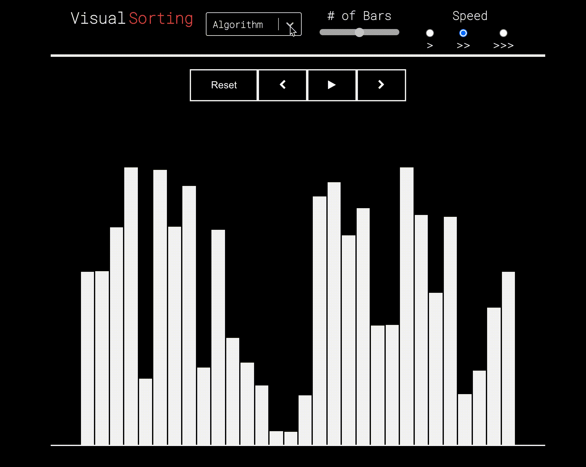

# Sorting Visualization Application

An application to demonstrate sorting algorithms visually, while (hopefully) looking pretty nice.
You can check it out at [visual sorting](https://lennox-davidlevy.github.io/Sorting_Algo_Visualizer/)



## Production

Made using React

You can download the application and run it locally:

```
$ git clone https://github.com/lennox-davidlevy/Sorting_Algo_Visualizer.git
$ cd Sorting_Algo_Visualizer
$ npm install
```

## Planned Implementations

I plan on adding these features soon:

- Insertion Sort
- Heap Sort
- Quick sort
- inversion view that inverts colors with a switch
- two sorting methods at the same time to compare each process visually
